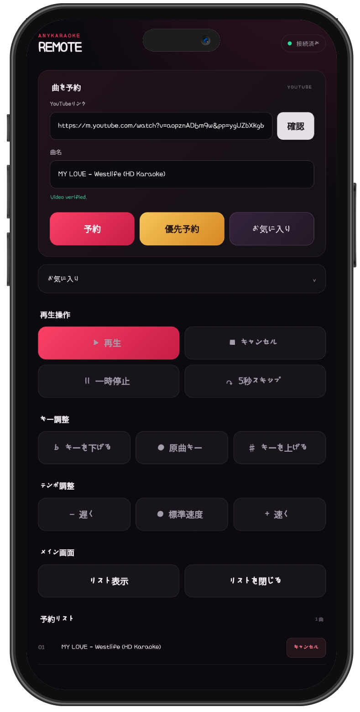

# AnyKaraoke

[English](README.md) · [한국어](README.ko.md) · [日本語](README.ja.md)

AnyKaraokeは、ブラウザをカラオケのメイン画面として使い、別のスマートフォンをリモコンとして利用できるサービスです。専用のアプリケーションサーバーを必要とせず、HTML、CSS、JavaScriptで動作します。埋め込み再生が許可されたYouTube動画を再生し、[dweet.cc](https://dweet.cc/)を通じて操作メッセージを送受信します。

AnyKaraokeを開く：[https://AnyKaraoke.pages.dev/](https://AnyKaraoke.pages.dev/)

対応言語：英語、韓国語、日本語、中国語、スペイン語、ポルトガル語、インドネシア語、フランス語

## 使い方

1. テレビ、パソコン、タブレットなどでメインページを開きます。
2. 表示されたQRコードを読み取るか、スマートフォンでリモコンURLを開きます。

3. リモコンにYouTube URLを貼り付けて、**確認**を押します。
4. 動画の確認後、通常予約、優先予約、またはお気に入りへの追加を選びます。
5. リモコンから再生、キー、テンポ、予約リストの表示を操作します。

ルームIDはメインページのURLに保持されます。更新後に直前の予約リストを復元する場合は、そのURLをそのまま使用してください。

## 主な機能

- 現在の曲と次の曲を表示する、全画面向けのメインプレーヤー
- QRコードまたはURLで接続するモバイルリモコン
- 通常予約、優先予約、予約取消、曲終了後の自動再生
- 再生、一時停止、取消、5秒先へ進むフレーズジャンプ
- 対応レシーバーまたはAndroidアプリによる`-6`～`+6`半音のキー調整
- YouTube動画ごとに利用可能な再生速度を使ったテンポ調整
- メイン画面の折りたたみ式予約リスト
- リモコンのブラウザ内に保存されるお気に入り
- 韓国語、英語、日本語、中国語、スペイン語、ポルトガル語、インドネシア語、フランス語の自動選択
- アカウントおよび専用AnyKaraokeアプリケーションサーバー不要

## キー調整

### デスクトップブラウザ

音程変換には、タブの音声キャプチャに対応したブラウザが必要です。

1. メインページでキー変更機能を有効にします。
2. レシーバー画面で**オーディオ共有を開始**を押します。
3. **AnyKaraoke**のメインタブを選び、タブの音声共有を有効にします。
4. AnyKaraokeの使用中はレシーバー画面を閉じないでください。

対応状況はブラウザやOSによって異なります。タブ音声のキャプチャを利用できない場合は、別の対応ブラウザまたはAndroidアプリを使用してください。

### Androidアプリ

AndroidアプリはAndroid 10以降に対応し、メディア音声を処理するためにAndroidの画面・音声キャプチャ権限を使用します。起動時に表示されるキャプチャ要求を許可してください。Android 14以降では画面全体のキャプチャを要求します。

最新のAPKは[GitHub Releases](https://github.com/maga32/AnyKaraoke/releases/latest)からダウンロードできます。

## 注意事項

- 動画の所有者がYouTubeの埋め込み再生を許可している動画のみ予約できます。AnyKaraokeはこの制限を回避しません。
- 再生、自動再生、利用可能な速度、音声キャプチャの動作は、ブラウザ、端末、OS、動画によって異なる場合があります。
- ルームURLを知っている人は、そのルームに操作命令を送信できます。アクセスを制限したい場合はURLを公開しないでください。
- 予約リストのメッセージはdweet.ccを経由します。リモコンのお気に入りは、そのブラウザの`localStorage`にのみ保存されます。
- AnyKaraokeは、YouTubeおよびdweet.ccのサービス提供状況やポリシーにより、機能の変更、一時停止、または終了となる場合があります。
