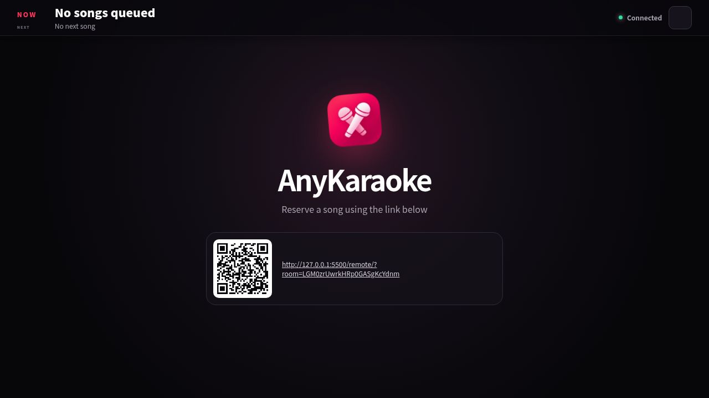
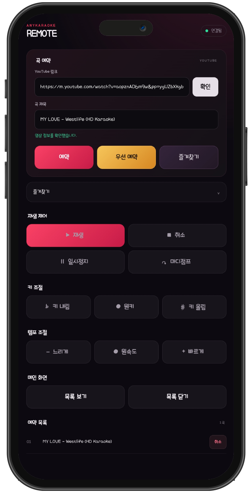

# AnyKaraoke

[English](README.md) · [한국어](README.ko.md) · [日本語](README.ja.md)

AnyKaraoke는 브라우저를 노래방 메인 화면으로 만들고, 다른 휴대폰을 리모컨으로 사용하는 서비스입니다. 별도의 애플리케이션 서버 없이 HTML, CSS, JavaScript로 동작하며, 외부 재생이 허용된 YouTube 영상을 재생하고 [dweet.cc](https://dweet.cc/)를 통해 명령을 주고받습니다.

AnyKaraoke 열기: [https://AnyKaraoke.pages.dev/](https://AnyKaraoke.pages.dev/)

지원 언어: 영어, 한국어, 일본어, 중국어, 스페인어, 포르투갈어, 인도네시아어, 프랑스어

## 사용 방법

1. TV, 컴퓨터, 태블릿 등의 화면에서 메인 페이지를 엽니다.
2. 표시된 QR 코드를 스캔하거나 휴대폰에서 리모컨 URL을 엽니다.

3. 리모컨에 YouTube URL을 붙여 넣고 **확인**을 누릅니다.
4. 영상 확인이 끝나면 일반 예약, 우선 예약 또는 즐겨찾기 추가를 선택합니다.
5. 리모컨에서 재생, 키, 템포와 예약 목록 표시를 조작합니다.

방 번호는 메인 페이지 URL에 유지됩니다. 새로고침 후 최근 예약 목록을 복구하려면 해당 URL을 그대로 사용하세요.

## 주요 기능

- 현재 곡과 다음 곡 제목을 표시하는 전체화면 중심 메인 플레이어
- QR 코드 또는 URL로 연결하는 모바일 리모컨
- 일반 예약, 우선 예약, 예약 취소와 곡 종료 후 자동 재생
- 재생, 일시정지, 취소와 5초 앞으로 이동하는 마디점프
- 호환되는 리시버 또는 Android 앱을 이용한 `-6`~`+6` 반음 키 조절
- YouTube 영상별 지원 배속을 이용한 템포 조절
- 메인 화면의 접이식 예약 목록 패널
- 리모컨 브라우저에 저장되는 개인 즐겨찾기
- 한국어, 영어, 일본어, 중국어, 스페인어, 포르투갈어, 인도네시아어, 프랑스어 자동 선택
- 계정 및 별도의 AnyKaraoke 애플리케이션 서버 불필요

## 키 조절

### 데스크톱 브라우저

음정 변환에는 탭 오디오 캡처를 지원하는 브라우저가 필요합니다.

1. 메인 페이지에서 키 변경 기능을 활성화합니다.
2. 리시버 창에서 **오디오 공유 시작**을 누릅니다.
3. **AnyKaraoke** 메인 탭을 선택하고 탭 오디오 공유를 활성화합니다.
4. AnyKaraoke를 사용하는 동안 리시버 창을 닫지 마세요.

지원 여부는 브라우저와 운영체제에 따라 다릅니다. 탭 오디오 캡처가 지원되지 않으면 다른 호환 브라우저 또는 Android 앱을 이용하세요.

### Android 앱

Android 앱은 Android 10 이상에서 동작하며, 미디어 오디오 처리를 위해 Android의 화면·오디오 캡처 권한을 사용합니다. 앱 실행 시 표시되는 캡처 요청을 승인해야 합니다. Android 14 이상에서는 전체 화면 캡처를 요청합니다.

최신 APK는 [GitHub Releases](https://github.com/maga32/AnyKaraoke/releases/latest)에서 받을 수 있습니다.

## 알아둘 점

- 영상 소유자가 YouTube 외부 재생을 허용한 영상만 예약할 수 있습니다. AnyKaraoke는 이 제한을 우회하지 않습니다.
- 재생, 자동재생, 지원 배속과 오디오 캡처 동작은 브라우저, 기기, 운영체제 및 영상에 따라 달라질 수 있습니다.
- 방 URL을 아는 사람은 해당 방에 명령을 보낼 수 있습니다. 접근을 제한해야 한다면 URL을 공개하지 마세요.
- 예약 목록 메시지는 dweet.cc를 거칩니다. 리모컨 즐겨찾기는 해당 브라우저의 `localStorage`에만 저장됩니다.
- AnyKaraoke는 YouTube 및 dweet.cc의 서비스 제공 상황이나 정책에 따라 기능이 변경되거나 서비스가 일시 중단 또는 종료될 수 있습니다.
