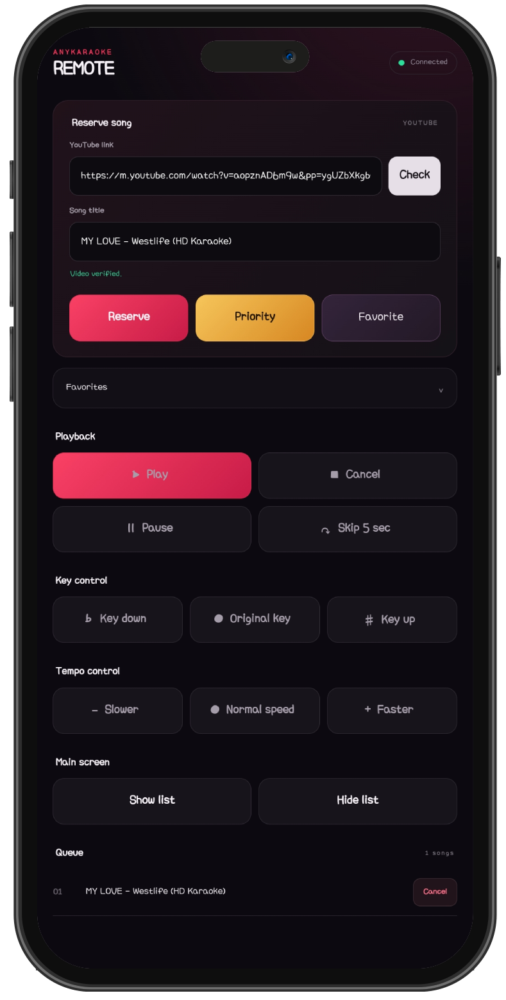

# AnyKaraoke

[English](README.md) · [한국어](README.ko.md) · [日本語](README.ja.md)

With AnyKaraoke, you can start a karaoke party wherever you are.

Sing with family at home, have fun with friends at a party, or bring the music along on a trip or car ride—turn any screen into your own karaoke experience.

Everyone can use their own phone as a remote. There is no need to pass a single remote around: each person can easily queue songs and control the music right from their phone.

Open AnyKaraoke: [https://AnyKaraoke.pages.dev/](https://AnyKaraoke.pages.dev/)

Supported languages: English, Korean, Japanese, Chinese, Spanish, Portuguese, Indonesian, and French

## How to use

1. Open the main page on a TV, computer, tablet, or other display.
2. Scan the displayed QR code or open the remote URL on a phone.

3. Paste a YouTube URL into the remote and select **Check**.
4. Once the video is verified, reserve it normally, place it at the front of the queue, or add it to your favorites.
5. Use the remote to control playback, pitch, tempo, and the queue display.

The room ID remains in the main page URL. Keep that URL if you want the main page to restore the latest queue after a refresh.

## Features

- Full-screen-oriented main player with current and next song titles
- Mobile remote connected by QR code or URL
- Normal and priority reservations, queue cancellation, and automatic next-song playback
- Play, pause, cancel, and five-second phrase jump controls
- Pitch control from `-6` to `+6` semitones through a compatible receiver or the Android app
- Tempo control using the playback rates available for each YouTube video
- Collapsible queue panel on the main screen
- Browser-local favorites on the remote
- Automatic UI language selection for Korean, English, Japanese, Chinese, Spanish, Portuguese, Indonesian, and French
- No account and no dedicated AnyKaraoke application server

## Pitch control

### Desktop browsers

Pitch conversion requires a browser that supports tab audio capture. When prompted:

1. Enable pitch control on the main page.
2. In the receiver window, select **Start audio sharing**.
3. Select the **AnyKaraoke** main tab and enable tab audio sharing.
4. Keep the receiver window open while using AnyKaraoke.

Browser and operating-system support varies. If tab audio capture is unavailable, use another compatible browser or the Android app.

### Android app

The Android app supports Android 10 or later and uses Android's screen/audio capture permission to process media audio. Approve the capture request when the app starts. On Android 14 or later, it requests full-screen capture.

Download the latest APK from [GitHub Releases](https://github.com/maga32/AnyKaraoke/releases/latest).

## Important limitations

- Only videos whose owners allow embedded YouTube playback can be reserved. AnyKaraoke does not bypass this restriction.
- Playback, autoplay, available speeds, and audio capture can vary by browser, device, operating system, and video.
- Anyone who knows a room URL can send commands to that room. Do not share it publicly when access should be limited.
- Queue messages pass through dweet.cc. Remote favorites stay only in that browser's `localStorage`.
- AnyKaraoke may be modified, interrupted, or discontinued depending on the availability and policies of YouTube and dweet.cc.
